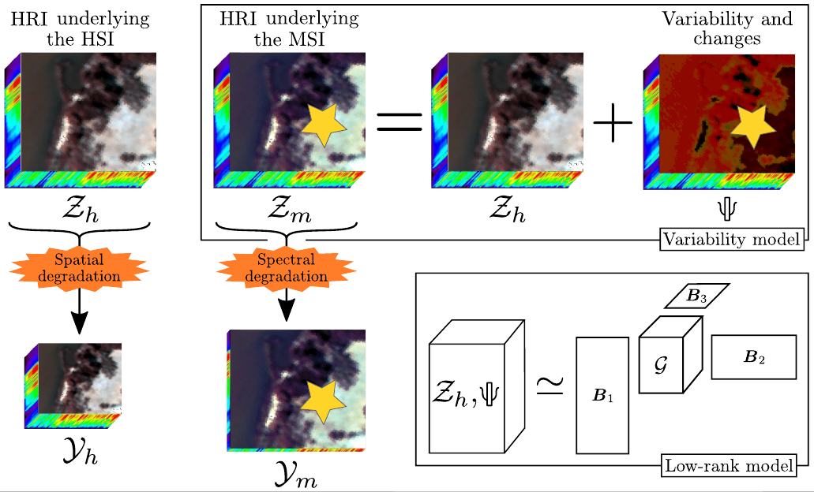

# Coupled tensor decomposition for hyperspectral and multispectral image fusion with inter-image variability  #

This package contains the authors' implementation of CT-STAR and CB-STAR image fusion methods, described in the paper:

    [1] Coupled tensor decomposition for hyperspectral and multispectral image fusion with inter-image variability
        R.A. Borsoi, C. Prévost, K. Usevich, D. Brie, J.C.M. Bermudez, C. Richard
        IEEE Journal of Selected Topics in Signal Processing 15 (3), 702-717, 2021.

## OVERVIEW

Coupled tensor decomposition has recently emerged as a promising approach for the fusion of hyperspectral and multispectral images, reconciling state of the art performance with strong theoretical guarantees. However, like most Hyperspectral (HS) and Multispectral (MS) image fusion models, existing tensor-based works assume that both images were acquired under the same conditions. Thus, when the HS and MS images are acquired at different time instants, the presence of seasonal or acquisition (e.g., illumination, atmospheric) variations often impacts negatively the performance of the algorithms. In this work we considered a more flexible tensor-based model that takes such variability into account, performing consistently well even when significant variations are observed while also having theoretical recovery guarantees. 

## IMPORTANT

If you use this software please cite the paper [1] in any resulting publication.

## MINIMAL REQUIREMENTS & RUNNING

In order to run the demos, you will have to
1.  Download and install Tensorlab 3.0: https://www.tensorlab.net

2.  Create folders named "results_examples" and "results_examples/estimPsis" where the results will be stored.

Then, just start MATLAB and run one of the demo scripts (e.g. example1_playa.m, example2_tahoe.m, etc).

## NOTES:
1.  Codes for the GLPHS, HySure, CNMF algorithms were provided by N. Yokoya, in [this toolbox](https://openremotesensing.net/wp-content/uploads/2017/11/HSMSFusionToolbox.zip).

2.  Code for the SCOTT algorithm was provided by C. Prévost, and are available in [this repository](https://github.com/cprevost4/HSR_Software).

3.  Codes for the STEREO algorithm were provided by C. Kanatsoulis, and are available in [this repository](https://github.com/marhar19/HSR_via_tensor_decomposition).

4.  The codes for the LTMR algorithm can be downloaded from [this link](https://github.com/renweidian/LTMR). 

